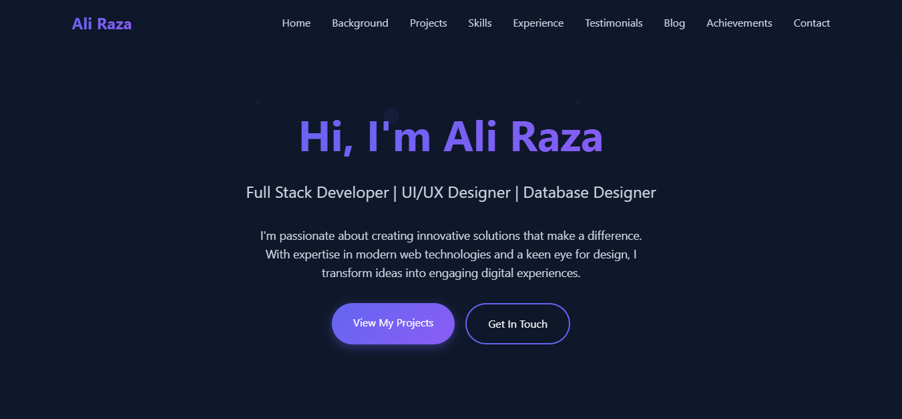
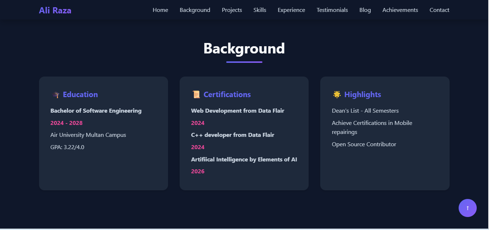
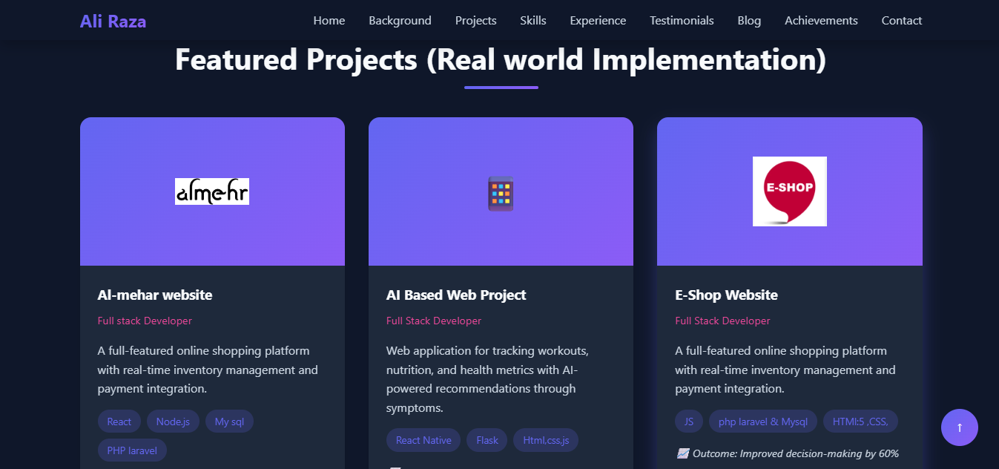
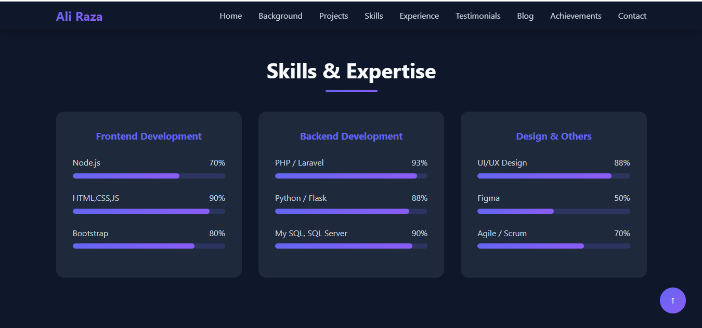
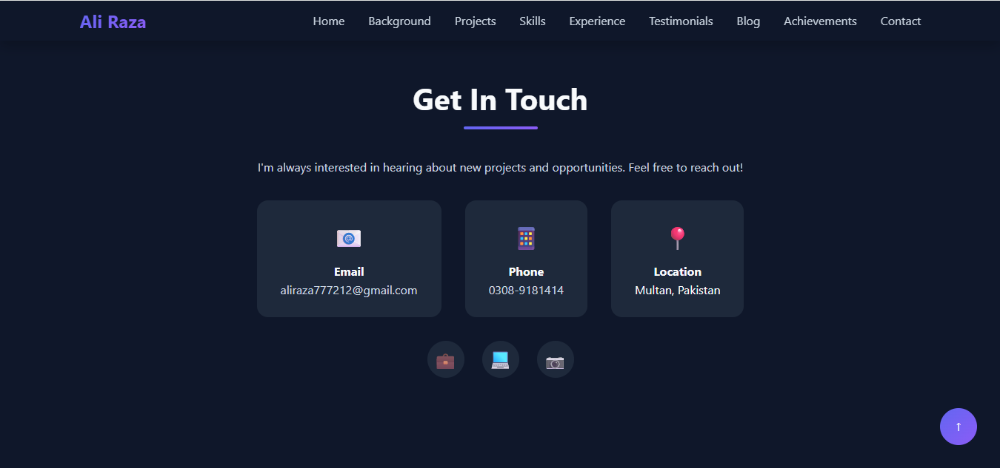

Personal Portfolio Website – Ali Raza

A modern, responsive personal portfolio website designed to showcase my skills, projects, experience, and achievements as a Software Engineering student and aspiring Frontend Developer.

This portfolio highlights my technical abilities, real-world projects, and passion for building clean, user-focused web interfaces.

Live Overview

This portfolio includes:

Professional hero/intro section

About & background information

Featured projects showcase

Technical skills section

Experience timeline

Testimonials

Blog section

Achievements

Contact form

Designed with a modern UI, gradient theme, and responsive layout for all devices.

🧰 Tech Stack

Frontend Technologies

HTML5

CSS3 (Custom styling, gradients, responsive design)

JavaScript

Design Features

Dark UI theme

Smooth navigation & layout

Responsive design

Modern typography and color palette
